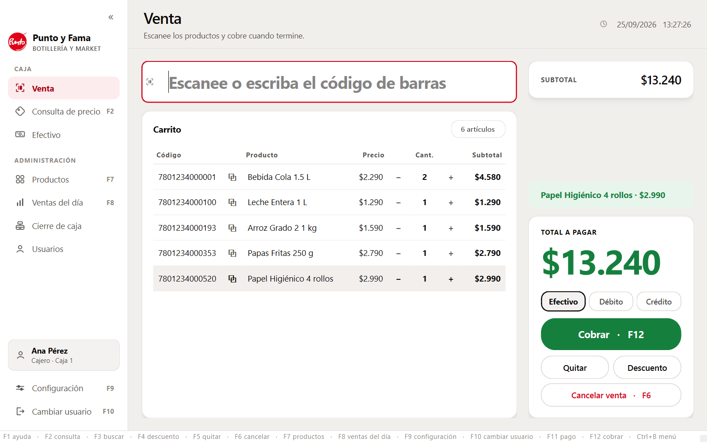

# Tienda POS — prototipo

Prototipo de sistema de punto de venta para una tienda pequeña (almacén / minimarket).
Aplicación de **escritorio Windows**: el usuario abre un acceso directo y el programa arranca.
No es una aplicación web y no requiere internet.

El núcleo es lo que pidió el cliente: **código de barras → producto → precio**.
Alrededor de eso, el prototipo demuestra una venta completa e inventario mínimo.



## Qué hace

- **Consulta de precio** a pantalla completa (F2), con el precio en letra grande.
- **Venta**: escaneo, carrito con agrupación de repetidos, descuento por monto o porcentaje,
  y cierre que registra la venta y descuenta el stock.
- **Catálogo**: alta, edición y baja de productos, con filtro y aviso de stock bajo.
- **Ventas del día**: total, número de ventas, artículos y detalle de cada una.
- **Acceso con PIN** y rol de administrador para lo que puede hacer daño.
- **Códigos no encontrados**: lo que se escanea y no existe queda anotado para cargarlo luego.
- Funciona **sin internet**, con respaldo automático de la base de datos en cada arranque.

## Estado

Prototipo funcional, ya presentado al cliente. **Hoy funciona en un solo PC.** Tras la primera
reunión se abrió una segunda etapa con lo que él sí pidió: rendimiento medido, importación de su
catálogo antiguo, dos cajas e instalador. Nada de eso está construido todavía: ver
[docs/PLAN.md](docs/PLAN.md), fases 8 a 14. *(Las familias y el precio de compra estuvieron en esa
lista hasta el 2026-09-14, cuando el cliente dijo que no le interesan.)*

## Requisitos

- Windows 10 u 11
- Python 3.11 o superior (solo para desarrollo; el ejecutable final no lo necesita)

## Ejecutar en desarrollo

```bash
python -m venv .venv
.venv\Scripts\activate
pip install -r requirements-dev.txt
python main.py
```

## Pruebas

```bash
pytest
```

## Construir el ejecutable

```bash
python tools/construir.py
python tools/crear_acceso_directo.py
```

Genera `dist/TiendaPOS/TiendaPOS.exe` y deja un acceso directo en el escritorio.
Para comprobar la instalación en otro equipo: `TiendaPOS.exe --verificar`.

## Documentación

| Documento | Para qué sirve |
|---|---|
| [docs/GUION-DEMO.md](docs/GUION-DEMO.md) | Guion paso a paso de la demostración al cliente |
| [docs/PREGUNTAS-CLIENTE.md](docs/PREGUNTAS-CLIENTE.md) | Preguntas de negocio pendientes para la reunión |
| [docs/DESPLIEGUE-TIENDA.md](docs/DESPLIEGUE-TIENDA.md) | Cómo está instalado el sistema en la tienda y cómo se mantiene |
| [docs/RESCATE-DATOS.md](docs/RESCATE-DATOS.md) | Cómo recuperar el catálogo del sistema anterior del cliente |
| [docs/MANUAL-USUARIO.md](docs/MANUAL-USUARIO.md) | Manual para quien opera la caja |
| [docs/TECNICA.md](docs/TECNICA.md) | Arquitectura, pruebas, empaquetado y deuda técnica |
| [docs/DECISIONES.md](docs/DECISIONES.md) | Decisiones técnicas importantes y su justificación |
| [docs/PLAN.md](docs/PLAN.md) | Fases, tareas y criterios de aceptación |
| [CLAUDE.md](CLAUDE.md) | Contexto, reglas y convenciones del proyecto |

## Aviso

Este es un **prototipo de demostración**. No emite boletas ni facturas, no está conectado al
SII, no registra medios de pago, **todavía** no funciona en varias cajas simultáneas, no maneja
familias ni precio de compra, no importa datos de otros sistemas, no maneja productos
por peso y no permite crear usuarios ni cambiar sus PIN desde el programa. Los productos y
precios que trae son un catálogo de ejemplo inventado.
