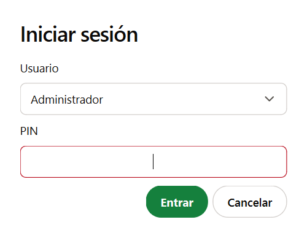
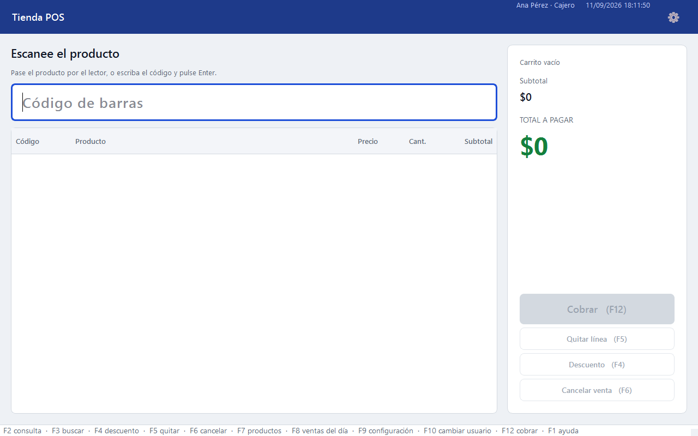
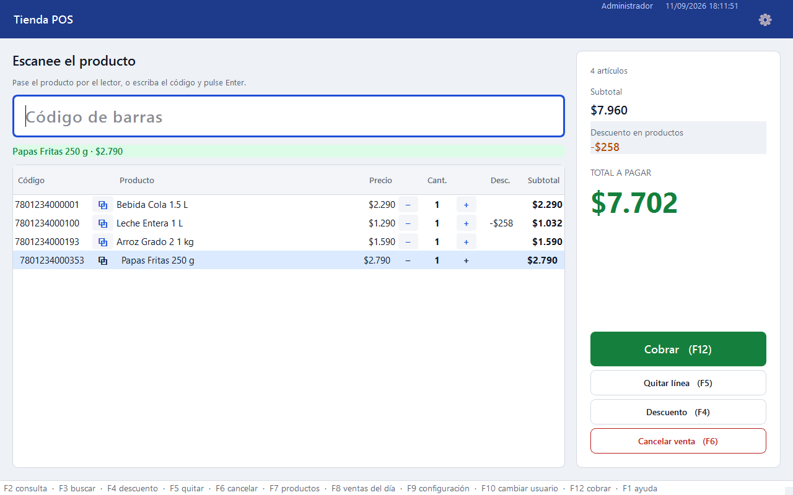
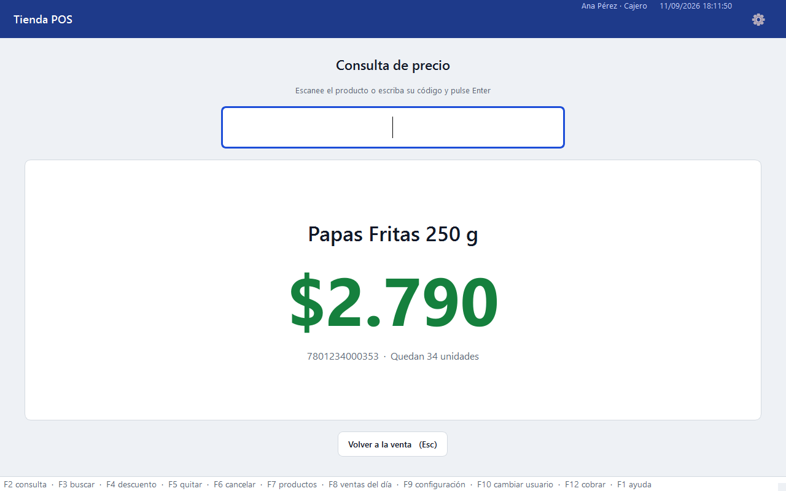
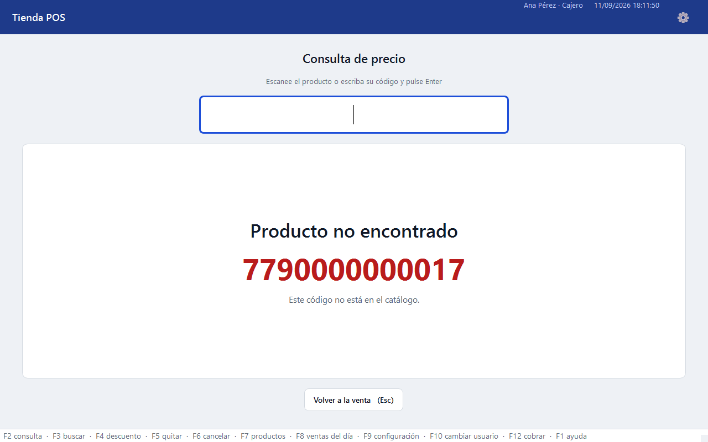
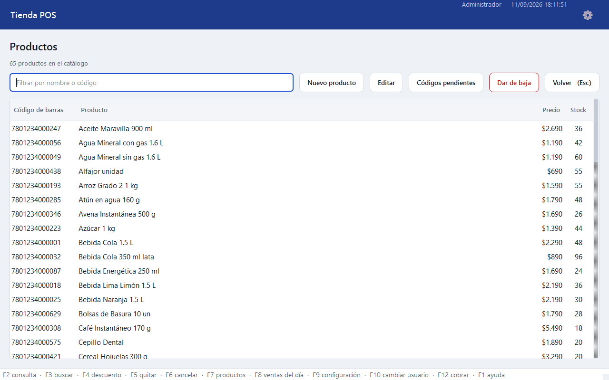
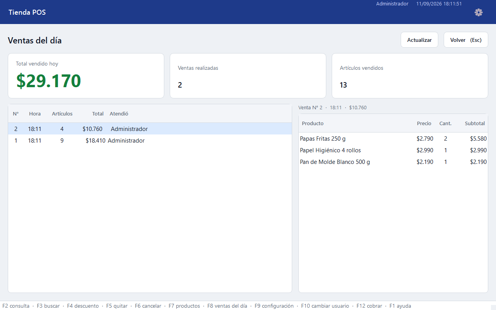
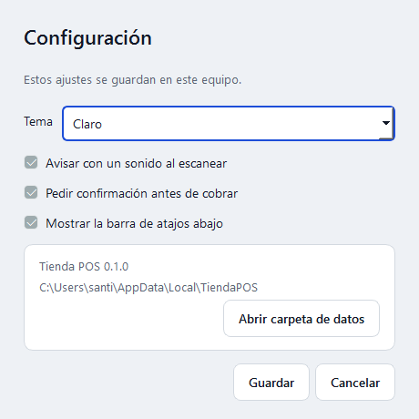

# Manual de usuario

Sistema de punto de venta **Tienda POS**. Este manual está escrito para quien atiende la
caja, no para quien programa.

---

## 1. Abrir el programa

Haga doble clic en el icono **Tienda POS** del escritorio.

El programa pide un usuario y un PIN:



En la versión de demostración vienen dos usuarios creados:

| Usuario | PIN | Qué puede hacer |
|---|---|---|
| Cajero | `1111` | Vender y consultar precios |
| Administrador | `1234` | Todo lo anterior, más cambiar precios y ver las ventas del día |

> **Estos PIN son de demostración y están publicados en este manual**, así que cualquiera que
> lo lea puede entrar. Sirven para probar el prototipo, no para usarlo con dinero real.
>
> **El prototipo todavía no tiene pantalla para cambiarlos ni para crear otros usuarios.**
> Es la primera pieza que hay que añadir antes de instalarlo en una tienda de verdad. Está
> anotado en [TECNICA.md](TECNICA.md) entre lo que falta.

---

## 2. Vender

Esta es la pantalla principal:



**Cómo se usa:**

1. Pase el producto por el lector de códigos de barras. Si no tiene lector, o el código está
   borrado, escriba el número y pulse **Enter**.
2. El producto aparece en la lista y el total se actualiza a la derecha.
3. Repita con todos los productos.
4. Pulse **F12** para cobrar y confirme.


**Cosas útiles que conviene saber:**

- Si pasa dos veces el mismo producto, no aparece dos veces: se suma la cantidad en la misma
  línea.
- No hace falta usar el ratón en ningún momento.
- Después de cada acción, el cursor vuelve solo al campo de escaneo. No tiene que hacer clic
  antes de pasar el siguiente producto.
- El lector de códigos funciona como un teclado. No hay que configurar nada.

### Cambiar la cantidad de un producto

Hay tres formas, y todas hacen lo mismo:

- Pulse el **+** o el **−** de esa línea en la lista.
- Seleccione la línea y use las **flechas del teclado**: **→** agrega una unidad y **←** quita
  una. Para moverse entre líneas, **↑** y **↓**.
- Pulse **F5**, que quita una unidad de la línea seleccionada.

Al bajar de una unidad, la línea desaparece del carrito.

> Las flechas actúan sobre el carrito **solo cuando el campo de escaneo está vacío**, que es
> como está casi siempre. Si tiene un código a medio escribir, las flechas sirven para
> corregirlo, como en cualquier otro programa.

### Copiar el código de un producto

Pulse el símbolo **⧉** que hay junto al código en la lista, o **Ctrl+C** con la línea
seleccionada. El código queda en el portapapeles, listo para pegarlo en un correo, en una
planilla o en la página del proveedor.

### Quitar un producto

Seleccione la línea en la lista y pulse **F5**. Si esa línea tenía varias unidades, se quita
una sola; si tenía una, se quita la línea entera.

### Cancelar la venta

Pulse **F6**. El sistema pide confirmación antes de vaciar el carrito.

### Aplicar un descuento

Pulse **F4**. El diálogo pregunta dos cosas:

1. **A qué se aplica:** a *toda la venta* o *solo al producto seleccionado*. Para descontar un
   producto, selecciónelo antes en la lista.
2. **Cómo se calcula:** un monto en pesos ("le dejo en cinco mil") o un porcentaje ("le hago
   el diez por ciento").



El descuento de un producto aparece en su propia línea, en la columna **Desc.**, y el panel de
la derecha indica de dónde viene el descuento total.

Cosas que conviene saber:

- Los dos descuentos se pueden combinar: primero se descuenta cada producto y después el
  descuento de la venta se calcula sobre lo que queda.
- Si aplica un porcentaje y después cambia las cantidades, el descuento se recalcula solo para
  seguir siendo ese porcentaje.
- El botón **Quitar descuento** retira el del ámbito que esté marcado arriba.
- Un descuento nunca puede dejar el total por debajo de cero.

---

## 3. Consultar un precio sin vender

Pulse **F2**. Esta pantalla sirve para responder "¿cuánto cuesta esto?" sin tocar la venta
que tenga en curso.



Pase el producto y el precio aparece en grande. La pantalla se limpia sola a los 15 segundos,
para que el precio de un cliente no quede a la vista cuando llegue el siguiente.

Pulse **Esc** (o **F2** otra vez) para volver a la venta.

**Importante:** consultar un precio aquí **no** agrega nada al carrito.

---

## 4. Cuando un producto no aparece

Si escanea algo que no está cargado en el sistema, aparece este aviso:



Qué hacer:

- **Si el producto sí existe pero su código está borrado o arrancado:** pulse *Buscar por
  nombre* y escriba parte del nombre. Elija el producto de la lista y se agrega al carrito.
- **Si el producto no está cargado:** el sistema anota el código en una lista de pendientes.
  El administrador lo verá después en *Productos → Códigos pendientes* y podrá cargarlo con
  calma, sin tener que acordarse ni anotarlo en un papel.

---

## 5. Administrar los productos (solo administrador)

Pulse **F7**. Si entró como cajero, el sistema le pedirá el PIN de un administrador. Esto
autoriza la acción, pero **no cambia quién está atendiendo la caja**: el encargado puede
autorizar y marcharse.



Desde aquí puede:

- **Filtrar** escribiendo parte del nombre o del código.
- **Nuevo producto**: dar de alta uno. Lo más cómodo es escanear el código con el lector en
  el campo del formulario.
- **Editar**: cambiar el nombre, el precio o el stock. También se abre con doble clic.
- **Dar de baja**: el producto deja de aparecer y no se puede vender. **No se borra**: las
  ventas antiguas siguen siendo correctas y consultables.
- **Códigos pendientes**: la lista de códigos que se escanearon en la caja y todavía no están
  cargados, ordenados por cuántas veces se intentaron.

El stock aparece **en rojo** cuando quedan 5 unidades o menos.

---

## 6. Ver las ventas del día (solo administrador)

Pulse **F8**.



Muestra cuánto se vendió hoy, en cuántas ventas y cuántos artículos. Al seleccionar una venta
de la lista, a la derecha aparece el detalle de lo que llevaba.

---

## 7. Cambiar de usuario

Pulse **F10**. Si hay una venta a medio armar, el sistema avisa antes: cambiar de cajero con
el carrito lleno es la forma más fácil de cobrarle a alguien lo que llevaba otro.

---

## 8. Configuración

Pulse **F9**, o la rueda dentada ⚙ de la esquina superior derecha.



| Ajuste | Para qué sirve |
|---|---|
| **Tema** | *Claro* (el de fábrica) u *oscuro*, para locales con poca luz o turnos de noche. El cambio se ve al instante, sin reiniciar. |
| **Avisar con un sonido al escanear** | El pitido que confirma que el producto entró sin mirar la pantalla. Se puede apagar si molesta. |
| **Pedir confirmación antes de cobrar** | Si se apaga, **F12** cierra la venta de inmediato. Más rápido, pero sin red de seguridad. |
| **Mostrar la barra de atajos abajo** | La franja con las teclas al pie de la ventana. |

El botón **Abrir carpeta de datos** lleva directo a donde están la base de datos, las copias
de seguridad y los registros. Es lo primero que le van a pedir si llama a soporte.

Los ajustes se guardan en este computador y siguen puestos la próxima vez que abra.

---

## 9. Todos los atajos de teclado

Pulse **F1** en cualquier momento para ver esta lista dentro del programa.

| Tecla | Qué hace |
|---|---|
| **Enter** | Agrega al carrito el producto escaneado |
| **F1** | Ayuda |
| **F2** | Consulta de precio a pantalla completa |
| **F3** | Buscar un producto por su nombre |
| **F4** | Aplicar un descuento |
| **F5** | Quitar una unidad de la línea seleccionada |
| **↑ ↓** | Moverse entre las líneas del carrito |
| **→** o **+** | Agregar una unidad a la línea seleccionada |
| **←** o **−** | Quitar una unidad de la línea seleccionada |
| **Ctrl+C** | Copiar el código de la línea seleccionada |
| **F6** | Cancelar la venta en curso |
| **F7** | Administrar productos *(administrador)* |
| **F8** | Ventas del día *(administrador)* |
| **F9** | Configuración |
| **F10** | Cambiar de usuario |
| **F12** | Cobrar |
| **Esc** | Volver a la pantalla de venta |

---

## 10. Sus datos

Toda la información vive en un único archivo en este computador:

```
%LOCALAPPDATA%\TiendaPOS\tienda.db
```

- **Copias de seguridad:** cada vez que abre el programa se guarda una copia en la carpeta
  `backups`, y se conservan las 7 más recientes. Para volver a una copia, cierre el programa,
  cambie el nombre de la copia a `tienda.db` y póngala en lugar del archivo original.
- **Registro de sucesos:** si algo falla, queda anotado en la carpeta `logs`. Ese archivo es
  lo que hay que enviar a quien dé soporte.
- El sistema **funciona sin internet**.

> **Lleve sus copias a otro sitio.** Las copias automáticas están en el mismo computador: lo
> protegen de un archivo corrupto, pero no de que el equipo se estropee o se lo roben. Copie
> la carpeta `backups` a un pendrive o a la nube de vez en cuando.

---

## 11. Si algo va mal

**Aparece un aviso de error.** El programa no se cierra: puede seguir trabajando. Revise el
carrito antes de cobrar, por si acaso, y avise a quien le dé soporte enviando el archivo de
la carpeta `logs`.

**El programa no abre.** Abra la carpeta donde está instalado y ejecute `TiendaPOS.exe` con
la opción `--verificar`. Se crea un archivo `autocomprobacion.txt` en
`%LOCALAPPDATA%\TiendaPOS\` que dice exactamente qué falló.

**El lector no parece funcionar.** Pruébelo en el Bloc de notas: si escribe los números ahí,
funciona, y entonces el problema está en que el cursor no estaba en el campo de escaneo.
Pulse **Esc** para volver a la pantalla de venta y vuelva a intentarlo.

---

## 12. Lo que este sistema todavía NO hace

Se dice aquí para que nadie cuente con ello:

- No emite boletas ni facturas, y no está conectado al SII.
- No registra formas de pago ni calcula vuelto.
- No funciona con varias cajas al mismo tiempo.
- No maneja productos que se venden por peso o a granel.
- No lleva un historial de movimientos de inventario: el stock es un número que baja al
  vender, sin registro de entradas ni ajustes.
- **No permite crear usuarios ni cambiar los PIN** desde el programa. Vienen dos usuarios
  fijos, los de la tabla del punto 1.
